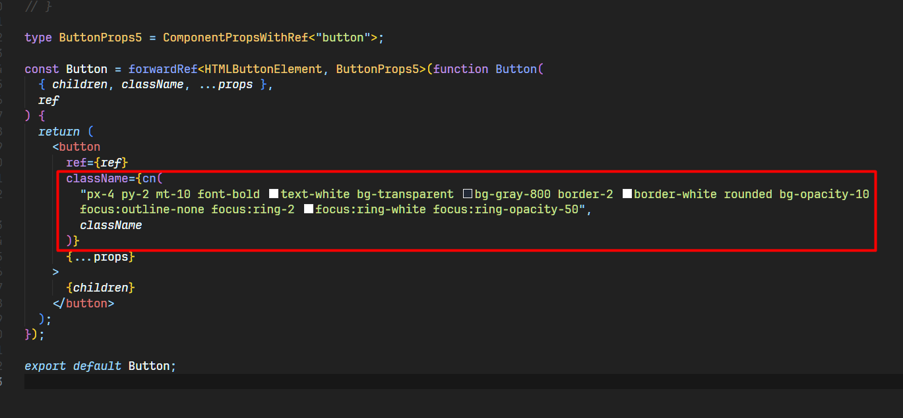
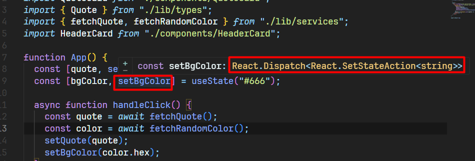
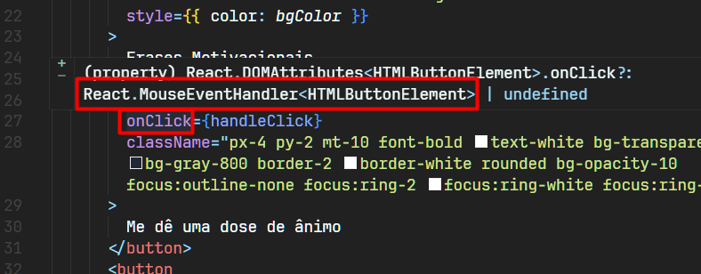
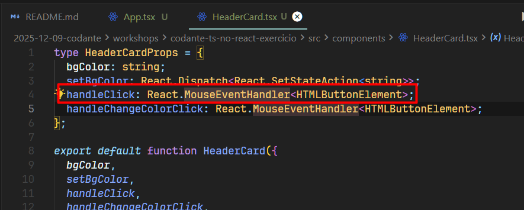

⛔⚠️✅

# Vscode

## Temas preferidos:

- Material Theme Darker High Contrast

- One Dark Pro Darker

- Extensões instaladas: 
  - Material Theme (But I Won't Sue You)
  - Palenight Theme (temas thecodeholic)
  - One Dark Pro


## Ícones de arquivo:

- Symbol Icons (Extensão Symbols)

## Ícones do menu lateral:

- Atom Material Icons (Extensão Atom Material Icons)

## Config Fonte:

- JetBrains Mono

- Config `settings.json`:

```json
{
    "files.autoSave": "afterDelay",
    "workbench.iconTheme": "symbols",
    "workbench.productIconTheme": "a-file-icon-vscode-product-icon-theme",
    "notebook.lineNumbers": "on",
    "liveServer.settings.donotShowInfoMsg": true,
    "svelte.enable-ts-plugin": true,
    "[javascriptreact]": {
        "editor.defaultFormatter": "esbenp.prettier-vscode"
    },
    "[typescriptreact]": {
        "editor.defaultFormatter": "esbenp.prettier-vscode"
    },
    "[html]": {
        "editor.defaultFormatter": "esbenp.prettier-vscode"
    },
    "[javascript]": {
        "editor.defaultFormatter": "esbenp.prettier-vscode"
    },
    "[css]": {
        "editor.defaultFormatter": "esbenp.prettier-vscode"
    },
    "[typescript]": {
        "editor.defaultFormatter": "esbenp.prettier-vscode"
    },
    "files.associations": {
        "*.mdx": "markdown"
    },
    "editor.wordWrap": "on",
    "editor.fontLigatures": "'calt', 'ss01', 'ss02', 'ss03', 'ss04', 'ss05', 'ss06', 'ss07', 'ss08', 'ss09', 'liga'",
    "terminal.integrated.env.windows": {},
    "console-ninja.featureSet": "Community",
    "workbench.colorTheme": "One Dark Pro Darker",
    "editor.fontFamily": "'JetBrains Mono', 'Monaspace Radon', Consolas, 'Courier New', monospace",
    "reactSnippets.settings.importReactOnTop": false,
}
```

# Ideias diversas

## Origamid

- Criar um sistema pra você registrar seus estudos, similar às aulas da origamid.

- Replicar sistema dos slides...

## Projeto mp-calculadora-imc

- ideia -> com o resultado do IMC, trazer dados estatísticos do que aquela faixa de IMC pode significar pro usuário... Talvez trazer informações conectados em uma IA chatgpt, sei lá...

- ✅ Fazer o deploy no github pages (passo a passo chatgpt)
- ✅ Implementar sweetalert2 no lugar dos alertas padrão...

# React 

## useEffect

### 1. `useEffect` sem array de dependências

```jsx
useEffect(() => {
  console.log('teste');
});
```

- Roda após TODO render:
    - 1ª vez: depois do primeiro render (montagem).
    - Depois: a cada atualização do componente (se algum state/prop mudar).
- Então, se esse componente tiver algum `useState` e você ficar mudando o state, esse `useEffect` vai ser executado toda vez.

A regra é: Sem array de dependências → roda depois de <b>toda</b> renderização.

### 2. `useEffect` com array vazio `[]`

```jsx
useEffect(() => {
  console.log('teste');
}, []);
```

- Roda apenas 1 vez:
    - Depois do primeiro render (quando o componente monta).
- Não importa quantas vezes o componente atualizar depois, esse efeito não é reexecutado.

### 3. `useEffect` com dependências `[algumaCoisa]`

```jsx
const [contador, setContador] = useState(0);

useEffect(() => {
  console.log("Mudou o contador");
}, [contador]);
```

- Roda:
    - Depois do primeiro render.
    - E depois toda vez que `contador` mudar.

## Obs funções React

### ✅ Correto

```jsx
<button onClick={global.limparDados}>Limpar</button>
```

- Função por referência. “React, quando esse botão for clicado, chama essa função aqui: `global.limparDados`.”

### ✅ Também correto – passar uma função que chama outra

```jsx
<button onClick={() => global.limparDados()}>Limpar</button>
```

- “React, quando esse botão for clicado, chama essa função anônima.
Dentro dela, eu chamo `global.limparDados()`.”

### ⛔ Erro

```jsx
<button onClick={global.limparDados()}>Limpar</button>
```

- A função roda na hora da renderização e não no clique. 


### Função com argumentos -> precisa da arrow

```jsx
<button onClick={() => global.apagarItem(id)}>
  Apagar {id}
</button>
```

### ⛔ Função com parâmetros direto, Errado

```jsx
// ERRADO!! chamaria imediatamente
<button onClick={global.apagarItem(id)}>Apagar</button>
```

## Spread

- spread consegue espalhar todas as chaves de um objeto como props
- pra cada chave do objeto, ele cria uma prop com o mesmo nome

Exemplo objeto:
```jsx
const produto = {
  nome: "Notebook",
  propriedades: ["16gb ram", "512gb"],
  preco: 5000,
  emEstoque: true,
};
```

Então:
```jsx
<Produto {...produto} />
```

vira:
```jsx
<Produto
  nome="Notebook"
  propriedades={["16gb ram", "512gb"]}
  preco={5000}
  emEstoque={true}
/>
```

Essa outra forma também funciona, escrevendo manualmente cada prop
```jsx
<Produto
  key={produto.nome}
  nome={produto.nome}
  propriedades={produto.propriedades}
/>
```


Exemplo arquivo `0212-desafio-componentes.jsx`
```jsx
{produtos.map((produto) => (
  // Jeito 1:
  // <Produto key={produto.nome} nome={produto.nome} propriedades={produto.propriedades} />

  // Jeito 2:
  <Produto key={produto.nome} {...produto} />
))}

const Produto = ({ nome, propriedades }) => {
  // ...
};
```

## Extensão Prettier TailwindCSS (padrão ordem classes)

```bash
npm install -D prettier prettier-plugin-tailwindcss
```

- Adicionar ao arquivo `.prettierrc` a config abaixo:

```json
{
  "plugins": ["prettier-plugin-tailwindcss"]
}
```
## Função Utilitária para trabalhar com classes em Componentes Flexíveis (padrão shadcn/ui) -> é um helper para className (cn)

- Instalação

```bash
npm install tailwind-merge clsx
```

- Criar um arquivo `lib/utils.ts` e colar código abaixo (shadcn)

```ts
import { clsx, type ClassValue } from "clsx";
import { twMerge } from "tailwind-merge";

export function cn(...inputs: ClassValue[]) {
  return twMerge(clsx(inputs));
}

```

- Utilizar o helper nas className nos componentes flexíveis




## TypeScript no React

- Tipagem de children:

```tsx
function Card({ children }: { children: React.ReactNode })
```

```tsx
type CardProps = {
  children: React.ReactNode;
};

export default function Card({ children }: CardProps) {
```

- Podemos utilizar classe utilitária `PropsWithChildren` do próprio React:

```tsx
import { PropsWithChildren } from "react";

export default function Card({ children }: PropsWithChildren) {
```

- Dica tipagem: passar o mouse (hover) em cima no vscode que consegue detectar alguns tipos "estranhos". 








# React Native

## Comandos Gerais

```bash
npm start # startar projeto expo
# ou
npx expo start
```

- Para conseguir acessar localhost via ip local de um projeto react, necessário configurar arquivo `vite.config.ts`, conforme abaixo

```ts
server: {
    host: "0.0.0.0", // 🔴 expõe na rede local
    port: 5173, // opcional, mas deixa fixo
  },
```

## Gerar APK via Projeto Expo

- Instalar EAS CLI

```bash
npm install -g eas-cli
```

- Verificar se instalou

```bash
eas --version
```

- Logar na conta Expo

```bash
eas login
```

- Inicializar o EAS no projeto -> linka o projeto local com o projeto expo

```bash
eas init
```

- Criar `eas.json` (config de build)

```bash
eas build:configure
```

- Editar ' eas.json' pra gerar APK (adicionar um profile chamado `android-apk` pra gerar APK):

```json
{
  "cli": {
    "version": ">= 16.28.0",
    "appVersionSource": "remote"
  },
  "build": {
    "development": {
      "developmentClient": true,
      "distribution": "internal"
    },
    "preview": {
      "distribution": "internal"
    },
    "production": {
      "autoIncrement": true
    },
    "android-apk": {
      "android": {
        "buildType": "apk"
      },
      "distribution": "internal"
    }
  },
  "submit": {
    "production": {}
  }
}
```

- Rodar o build pra gerar o APK

```bash
eas build --platform android --profile android-apk
```

Durante o processo pode rolar perguntas tipo:
- gerar keystore automaticamente? → pode responder Yes.
- confirmar o projeto, etc.

No final, vai aparecer algo como:

```txt
✔ Build finished

Android build details: https://expo.dev/accounts/gabrielzemuner/projects/imc-react-native/builds/ALGUM-ID
```

# Comandos Git

```bash
git init
git add README.md
git commit -m "first commit"
git branch -M main
git remote add origin https://github.com/gabrielzemuner/codante-ts-no-react-exercicio.git
git push -u origin main
```

- Caso seja um projeto clonado de outro repositório, necessário setar novo link remote.

Substituir:
```bash
git remote add origin https://github.com/codante-io/codante-ts-no-react-exercicio.git
```

Por:
```bash
git remote set-url origin https://github.com/gabrielzemuner/codante-ts-no-react-exercicio.git
```

- Listar remotes/URLs

```bash
git remote -v
```

- Verificar branches

```bash
git branch
```


# Github Actions

- Ajustar `vite.config.ts` 

```ts
import { defineConfig } from "vite";
import react from "@vitejs/plugin-react";

export default defineConfig({
  plugins: [react()],
  base: "/mp-calculadora-imc/", // 👈 nome exato do repositório
});
```

- Comando pra gerar workflow de projetos react com vite para deploy no github pages

```yml
name: Deploy Vite app to GitHub Pages

on:
  push:
    branches: ["main"]   # se o nome da branch for "main"
  workflow_dispatch:      # permite rodar manualmente também

permissions:
  contents: read
  pages: write
  id-token: write

concurrency:
  group: "pages"
  cancel-in-progress: false

jobs:
  build:
    runs-on: ubuntu-latest
    steps:
      - name: Checkout
        uses: actions/checkout@v4

      - name: Setup Node
        uses: actions/setup-node@v4
        with:
          node-version: 22

      - name: Install dependencies
        run: npm ci

      - name: Build
        run: npm run build

      - name: Upload artifact
        uses: actions/upload-pages-artifact@v3
        with:
          path: ./dist   # Vite gera aqui

  deploy:
    needs: build
    runs-on: ubuntu-latest
    environment:
      name: github-pages
      url: ${{ steps.deployment.outputs.page_url }}
    steps:
      - name: Deploy to GitHub Pages
        id: deployment
        uses: actions/deploy-pages@v4
```