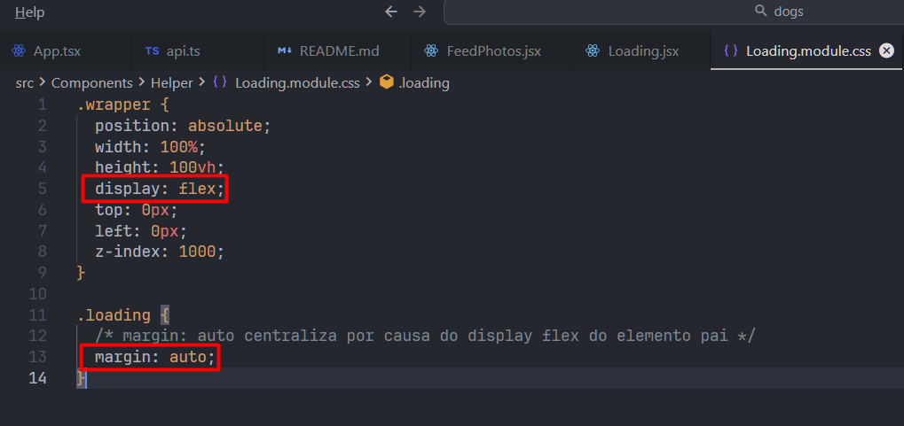
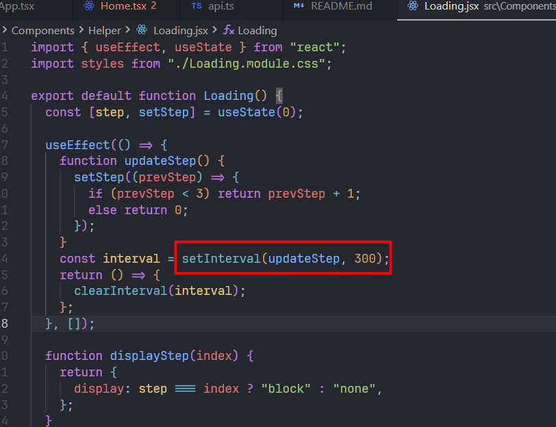

- Modo de estudo: pesquisar com exemplos e colocar print (resolução jsfiddle...)

## CSS

- margin: auto centraliza por causa do display flex do elemento pai



- diferenças display block, inline, inline-block

- vazamento de memória no useEffect ???? -> professor falou que setInterval(updateStep, 300) direto (sem const interval e sem clearInterval causa vazamento de memória). Aí ele ajustou o código conforme abaixo... Não entendi foi nada, tanto a parte de const (que ele disse pegar valor de referência) quanto o return com callback dentro do useEffect (return () => {clearInterval(...)})...

```jsx
  useEffect(() => {
    function updateStep() {
      setStep((prevStep) => {
        if (prevStep < 3) return prevStep + 1;
        else return 0;
      });
    }
    setInterval(updateStep, 300);
  }, []);
```

novo código:
```jsx
  useEffect(() => {
    function updateStep() {
      setStep((prevStep) => {
        if (prevStep < 3) return prevStep + 1;
        else return 0;
      });
    }
    const interval = setInterval(updateStep, 300);
    return () => {
      clearInterval(interval);
    };
  }, []);
```





## React

- porque executar códigos de manipulação da dom dentro de useeffect, exemplos: document.title. Porque não usar useEffect ao invés de useRef quando queremos pegar um elemento da dom então??

### `useDeferredValue`

- Hook do react similar ao debounce (vídeo do youtube da fernanda kipper...) 

### lazy/suspense -> 

- Benefício: deixar determinado código importado específico para o componente que utiliza ele. No caso abaixo que temos uma biblioteca com uma lib de gráficos, sem o lazy/suspense esse código seria carregado em todas as páginas...

Antes:
```jsx
import UserStatsGraphs from "./UserStatsGraphs";

export default function UserStats() {
  ....

  return (
    <div>
      <Head title="Estatísticas" />
      <UserStatsGraphs data={data} />
    </div>
  );
}
```

Depois:
```jsx
import { lazy, Suspense } from "react";
const UserStatsGraphs = lazy(() => import('./UserStatsGraphs'))

export default function UserStats() {
  ....

  return (
    <Suspense fallback={<div></div>}>
      <Head title="Estatísticas" />
      <UserStatsGraphs data={data} />
    </Suspense>
  );
}
```

Não precisa passar nada pro fallback do suspense, pois nesse componente temos uma lógica de um componente carregando `<Loading />`