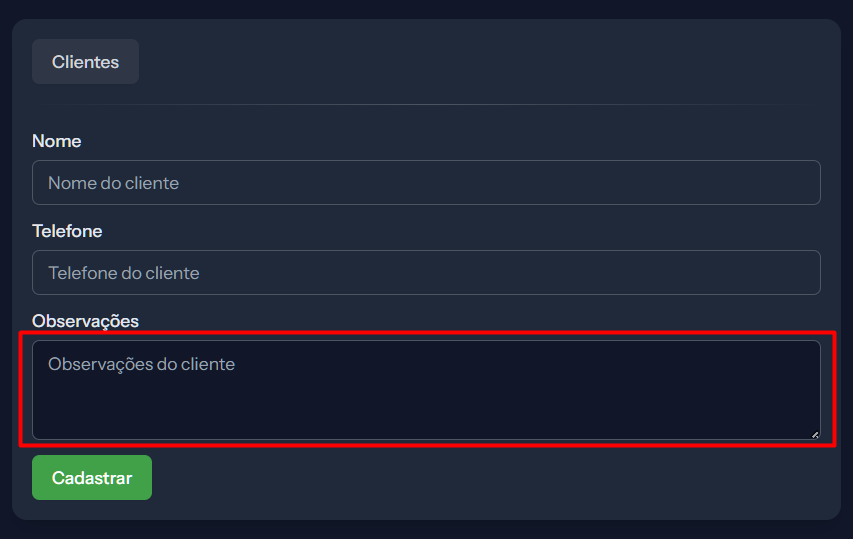
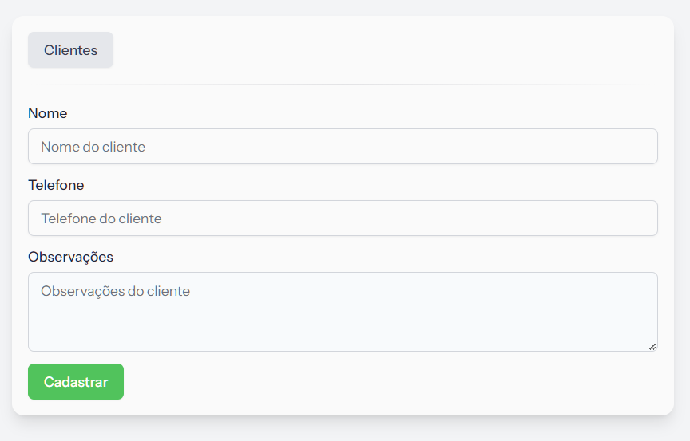
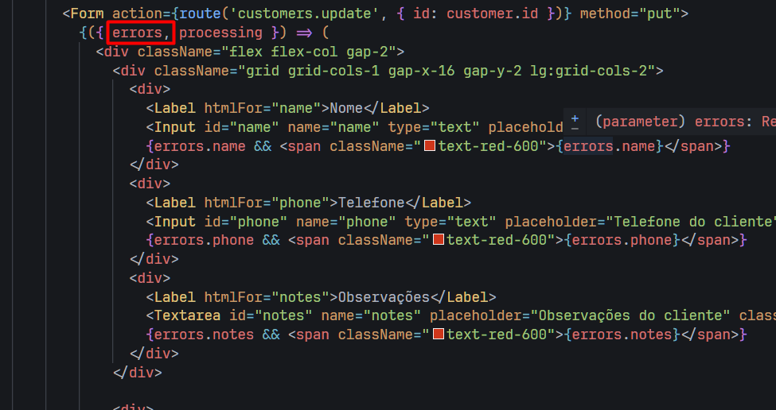

### Obs projeto com Inertia 2 + Shadcn + Ziggy (ao invés de wayfinder)

```
git clone https://github.com/laravel/react-starter-kit.git terus-web
git checkout 21e50ce^
```

### Projetos/arquivos para estudar

- Services => regra de negócio separado da controller, facilitando utilizar inertia-laravel com react-native

- anotações do projeto `astro-starlight` (dev laravel 10, laravel 11 com inertia etc...)

- projeto `laravel11-react`

- projeto `react-4-all`

- projeto `the-codeholic react`

### Tarefas

- ⛔ botão visualizar, faz sentido usar modal? com modal não apareceria id cadastrado (fazer teste na página de lembretes por ex:) -> o modal atenderia visualizar, cadastrar e editar 

- porque o fundo do textarea no modo dark tem cor diferente dos demais inputs? (obs: no cadastrar aula do laravel-react-4-all está certo)





- ✅ configurar erros do frontend (`usePage().props`) de forma global, similar aos erros do backend (`<AppLayout />`)

    - resolvido através do novo form do inertia 2, utilizando {errors} disponível

    

- tratar erros em um componente, mantendo esse padrão

- substituir modal do shadcn pelo modal do sweetalert2

- trocar mensagens do flash por mensagens na própria controller + toast (`<AlertMessage />`)

- analisar se faz sentido utilizar new form do inertia 2

- verificar cor do sonner escura em temas claros -> theme system, tem que verificar em conjunto com o ThemeProvider, pois algo está acontecendo que o tema selecionado do projeto não está sendo acompanhado pelo tema do sooner


### Padronizações do projeto

- controller exemplo com comentários: `CourseController`

- resources: utilizar `NameResource::collection(...)` no método index e `new NameResource(...)` nos métodos show e edit

- registrar logs apenas `Log::info()` => como temos log e audits (tabela), não faz sentido salvar log de info. Salvar logs de warning apenas para encontrar os eventuais erros que acontecerem no sistema. 