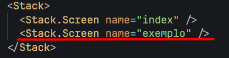
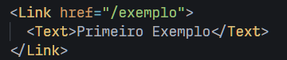
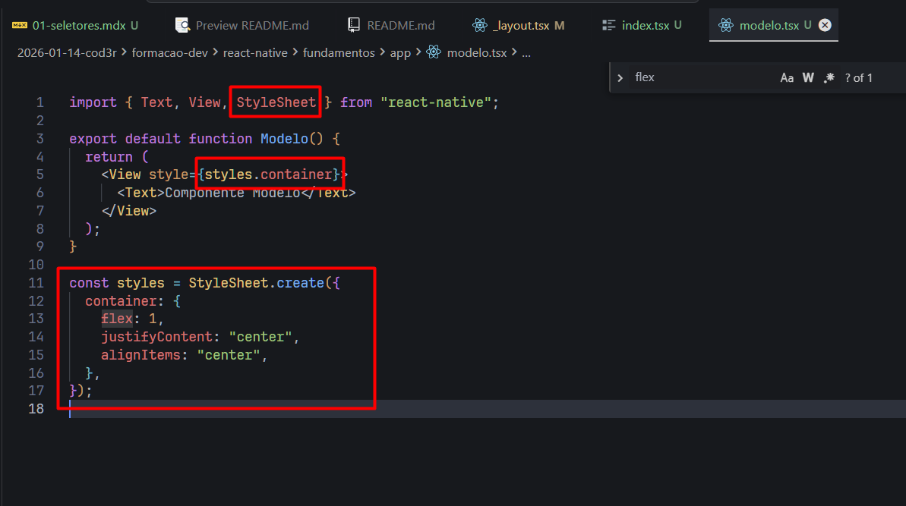
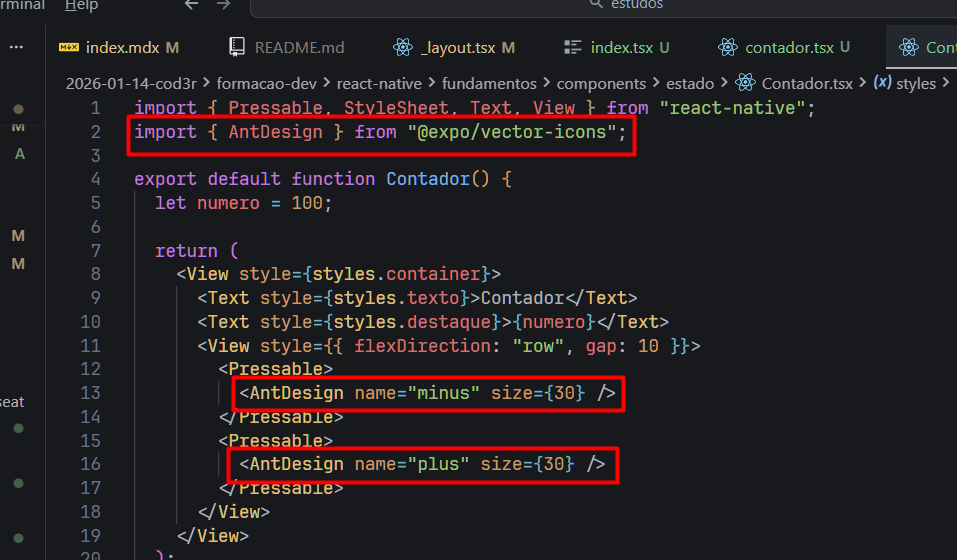

## Fundamentos

### Configurações iniciais

- serão criados vários projetos pra trabalhar com react-native... 

- primeiro projeto voltado para os fundamentos

```
npx create-expo-app@latest .
```

- ao criar o projeto, temos disponível um script pra resetar o projeto (começar do zero)

```
npm run reset-project
```

- após resetar o projeto, foi criado uma pasta app-example com várias outras pastas utilizadas no projeto inicial (app, components, hooks, constants, scripts). Deletamos essa pasta pois não vamos utilizar

- é comum enfrentar problemas no desenvolvimento de um projeto com react-native... O ambiente tem um pouco mais de instabilidade comparado com o ambiente web... 

### Anotações

- base: html, css e javascript (jsx), react

- `<View>` funciona como se fosse uma `<div>`

- Passo a passo dos exemplos/exercícios

    1. Criar um novo arquivo em app

    2. Declarar uma nova tela em `_layout.tsx`

         *passo opcional. É necessário caso precise de alguma personalização na tela*

    3. Criar um link de navegação no arquivo `index.tsx` para a nova tela

        


- Explicação sobre componente funcional, exemplo de função no arquivo `temp/funcao.js` pra explicar como funcionam os componentes React com JSX

- Não conseguimos renderizar texto fora de uma tag `<Text></Text>`

- Flexbox: o eixo principal do flexbox em dispositivos móveis é `column`

- Aplicando CSS com StyleSheet do react-native



- Existe uma biblioteca pra usar tailwind com react-native => `nativewind`. Porém, em testes, professor achou bem instável... Às vezes funcionava, às vezes não funcionava... Vamos utilizar a forma mais tradicional

- <h1><i>Podemos fazer um teste com `nativewind` depois...</i></h1>

- Professor teve a ideia de se inspirar no tailwind (classes utilitárias) pra tentar aplicar uma lógica parecida no nosso projeto com react native

- Componentes que representam uma página estão dentro da pasta `app`. Componentes que representam partes/fragmentos de uma página, componentes reutilizáveis, ficarão dentro da pasta `components`

- O expo por padrão disponibiliza algumas bibliotecas de ícones, utilizando o import de `"@expo/vector-icons"`



- Exemplo Desafio Mega -> ideia de separar as responsabilidades, não colocar lógica (cálculos) dentro do componente...