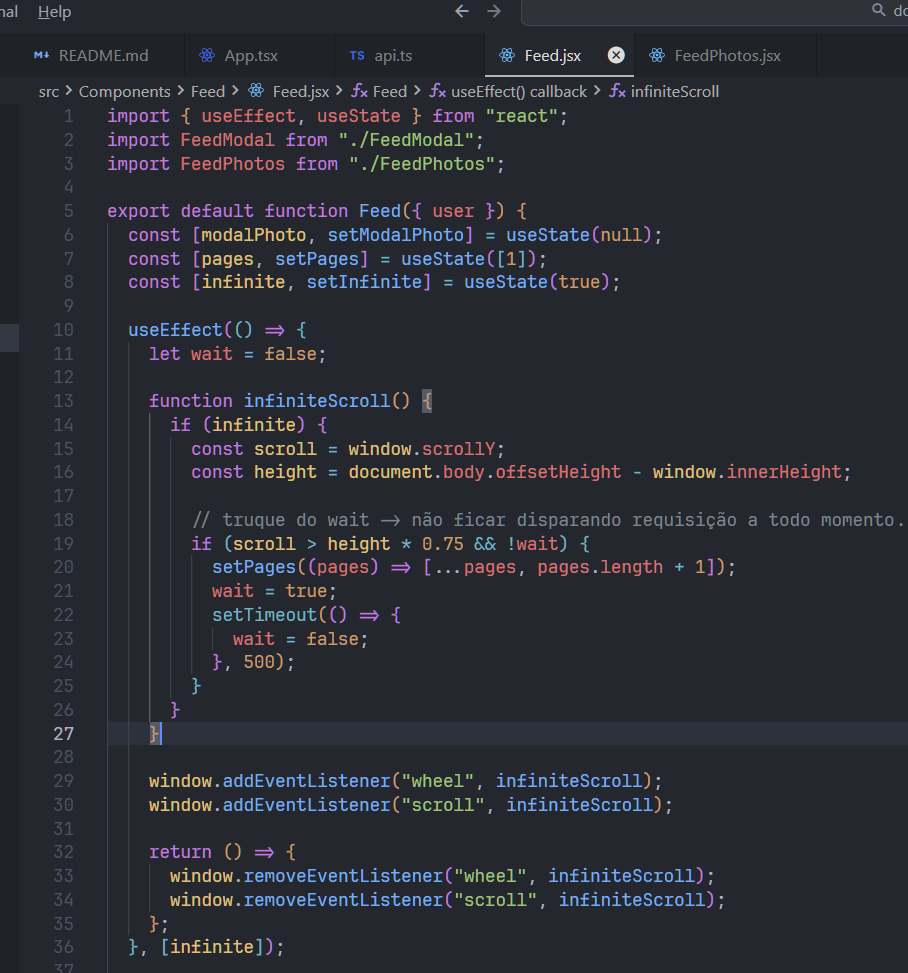

## Arquivo `PhotoComments.jsx`

- [⛔] ordenar os comentários pra exibir os primeiros por cima. Mudar lógica atual onde existe um useEffect que roda o scroll da página pra exibir último comentário (lá embaixo...)

  - Essa lógica deve ser resolvida no banco de dados 

## Arquivo `Feed.jsx`

- A lógica abaixo, não faz mais sentido verificar a quantidade de páginas da api e "bloquear" as requisições em cima desse valor, ao invés de criar uma mini-gambiarra com a variável wait?

- Parece que existem 2 lógicas, 1 lógica do wait pra não disparar requisição de todas as páginas e a lógica do infinite, pra bloquear mais requisições além da qtd de páginas disponíveis...

## Refatoração

- [✅] Melhorar organização das rotas que são páginas (arquivos `<Routes>`)

- [⛔] Substituir css modules por tailwindcss (tentar simplificar várias coisas, aplicando lógica minha, bastante flexbox etc...)

- [⛔] Incluir typescript (projeto dogs no curso de next)

- [⛔] Utilizar mais useContext... Por ex: componente `Feed.jsx` que passa uma função `setModalPhoto` para outro componente (`<FeedPhotos />`) que também passa essa mesma função para outro componente (`<FeedPhotosItem />`)

- [⛔] Incluir toastjs ou sweetalert2

- Construir novo modal (lógica diferente do professor ex: openModal true/false ao invés de event.target/event.currentTarget)

- Rotas com erro 404 com problema... Ex: http://localhost:5173/conta/456 -> renderiza o texto 'Página Incorreta' com um menu...

http://localhost:5173/perfil/teste -> também é possível acessar essa rota...

- [✅] Verificar componente `<Feed />`. Ele recebe props {user} mas no componente `<Home />` isso não é passado.... Estranho???

## Criar a API com laravel

- [✅] Mantendo o mesmo padrão, nomenclaturas etc...

## Pesquisar conceitos javascript

- optional chaining (componente Head)

- type narrowing (componente Photo)
